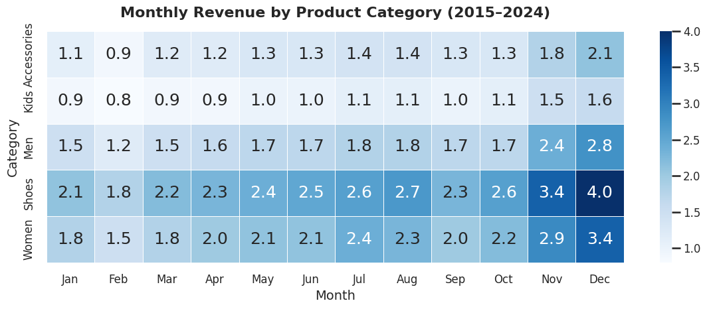

# Business analysis of sales, products and customer behaviour from 2015 to 2024

## What Was Really Driving Revenue Growth in Fashion Retail?

Revenue growth is usually associated with selling more products. While exploring this dataset, I noticed that the company followed a different pattern. Revenue continued to rise, but the annual number of orders remained almost unchanged. This raised the question that shaped the entire project:

**If the business was not processing more transactions, where was the additional revenue coming from?**

To answer this question, I started with the gap between revenue and order volume and tested the most plausible explanations one by one: larger baskets, higher product prices, a shift towards more expensive products and changes in discounting. Once the main revenue driver became clear, I extended the analysis into seasonality, market performance, product categories and customer behaviour.

The project is based on 256,506 sales records, 2,500 products and 3,741 recorded inventory rows. Orders with missing discounts remain available for customer and order activity analysis, but they are excluded from calculations that require net revenue. Records containing an unresolved quantity anomaly are excluded from the main analytical population because their validity could not be confirmed.

---

## Revenue increased, but the business was not processing more orders

The first step was to compare annual net revenue with the number of analysed orders. If revenue growth had been driven mainly by higher transaction volume, both measures should have increased at a similar pace.

<p align="center">
  
</p>

<p align="center">
  <i>Figure 1. Nominal net revenue increased despite a nearly unchanged number of annual orders.</i>
</p>

Between 2015 and 2024, nominal net revenue increased by 36.8%, while the number of analysed orders increased by only 1.1%. Annual order volume stayed close to 21,000 throughout the period, yet revenue rose from approximately 9.1M to 12.4M.

Average Order Value provided the first important clue. It increased from 436 in 2015 to 590 in 2024, a rise of 35.3%. The company was therefore generating considerably more revenue from almost the same number of transactions.

That explained where the difference appeared mathematically, but not what had changed inside those transactions. Higher order values could still result from customers buying more units, purchasing a more expensive mix of products, paying higher prices for the same products or receiving different levels of discounting.

The next step was to separate these explanations.

## Customers were not buying substantially more units

I first checked whether the increase could be explained by higher sales volume. Total units sold were compared with the quantity-weighted gross unit price.

A weighted price was more appropriate than a simple average because products were sold in very different quantities. A product sold once should not influence the measure as much as a product sold thousands of times.

<p align="center">
  
</p>

<p align="center">
  <i>Figure 2. Units sold remained stable while the quantity-weighted unit price increased.</i>
</p>

Units sold increased by only 0.5% between 2015 and 2024, while the quantity-weighted gross unit price increased by approximately 36.0%.

With both order count and unit volume almost unchanged, selling more products could not explain the increase in revenue. The main numerical change was the value attached to the products being purchased.

There were still two possible explanations for the higher weighted price. Customers might have shifted towards more expensive products, or the recorded prices of individual products might have increased.

To distinguish between these effects, I compared products that were sold in both 2015 and 2024. Within this common-product population, 99.5% of the increase in weighted unit price was explained by product-level price changes, while changes in product unit shares explained only 0.5%.

**The main revenue increase was therefore price-led rather than volume-led.**

This conclusion describes the numerical pattern in the available data. It does not prove that a particular pricing strategy caused the growth, nor does it show whether higher nominal revenue translated into better profitability. Inflation, product costs, competitor prices and margins are not available.

## Sales increasingly occurred in higher nominal price ranges

The price-range analysis initially appeared to suggest another explanation: perhaps customers had gradually moved towards more expensive products.

<p align="center">
  
</p>

<p align="center">
  <i>Figure 3. Premium and High-End products accounted for a growing share of sold units.</i>
</p>

Between 2015 and 2024, the Premium share of sold units increased by 14.4 percentage points and the High-End share by 11.3 points, while the Budget share fell by 14.8 points.

Viewed on its own, this looks like a clear shift towards more expensive products. The earlier product-level decomposition shows why that interpretation would be misleading.

The price ranges are nominal. When the recorded price of the same product increases, that product can move into a higher segment even if customers continue buying the same item. A larger Premium or High-End share therefore does not automatically mean that customer preferences changed.

The two results need to be read together. Sales increasingly appeared in higher nominal price ranges, but almost all of the change in weighted price came from increases in individual product prices rather than from a substantial change in the product mix.

**What looked like premiumisation at first was mainly the effect of products moving into higher nominal price bands as their prices increased.**

## The same seasonal pattern appeared in every analysed year

Once the main driver of long-term revenue growth was identified, I looked at how revenue was distributed throughout the year.

<p align="center">
  
</p>

<p align="center">
  <i>Figure 4. Cumulative net revenue by calendar month across 2015–2024.</i>
</p>

The aggregated monthly view shows a clear year-end peak, with December generating the highest revenue and February the lowest.

Because the chart combines ten years of data, I checked the annual series separately to make sure that the pattern was not being created by only a few unusual years. December was the strongest month and February the weakest in every analysed year from 2015 to 2024.

The difference also remained substantial after accounting for the different number of days in each month. Average daily revenue in December was 2.03 times the February level.

**The year-end increase was therefore a recurring seasonal pattern, not simply an artefact of month length or a small number of exceptional years.**

This makes the result relevant for staffing, fulfilment capacity and stock preparation. It does not automatically imply that additional Christmas promotion would increase profit, because that would require campaign costs, contribution margins and evidence of incremental sales.

I then checked whether the seasonal peak was concentrated in one product category or appeared more broadly across the assortment.

## The year-end peak was visible across the whole assortment

To test whether seasonality was concentrated in one part of the business, I compared monthly revenue across the major product categories.

<p align="center">
  
</p>

<p align="center">
  <i>Figure 5. Monthly revenue pattern across major product categories from 2015 to 2024.</i>
</p>

The heatmap shows that the year-end increase was not created by a single category. Revenue strengthened in November and December across every major product group.

Shoes and Women generated the highest monthly revenue, but the same seasonal direction was visible in Accessories, Kids, Men, Shoes and Women.

If the peak had been concentrated in one category, planning could focus mainly on that part of the assortment. Instead, the pattern appears across the wider business.

**The year-end peak should therefore be treated as a company-wide capacity pattern rather than a category-specific effect.**

## Revenue was distributed across a wider customer base than expected

The next part of the analysis focused on the customer base. I wanted to understand whether the company depended heavily on a relatively small group of high-value customers.

<p align="center">
  
</p>

<p align="center">
  <i>Figure 6. More than half of active customers were required to generate 80% of analysed revenue.</i>
</p>

In 2024, 55.2% of active customers were required to generate 80% of analysed revenue. The highest-spending 10% generated 25.9%, while the lower half of customers generated 24.0%.

The customer base therefore did not follow a classic 80/20 pattern. Revenue was distributed across a relatively broad group rather than being dominated by a small number of customers.

This meant that focusing only on the highest-spending customers would not provide enough information about the stability of the customer base. I therefore checked how many customers remained active across consecutive years.

Among customers active in 2024, 32.5% had also made a purchase in 2023. This group generated 33.2% of analysed 2024 revenue, meaning that its revenue contribution was almost proportional to its share of the active customer population.

I describe this as consecutive-year activity rather than formal retention. The dataset does not contain a confirmed customer acquisition date or a defined purchase cycle, and the absence of a transaction in one calendar year does not prove that a customer permanently left the company.

This leads to a more useful forward-looking question: **which characteristics distinguish customers who continue purchasing from those who do not appear in the following year?**

That question moves the analysis beyond historical customer value and towards understanding the stability of future customer activity.

# Supporting business views

The main charts explain the central revenue pattern. The following tables add context by showing how discounting, markets and product categories fit into the same picture.

## Discounting was concentrated at moderate levels

Discounting was part of normal commercial activity throughout the analysed period, so I also checked whether the business appeared to rely heavily on large discounts.

<p align="center">
  
</p>

<p align="center">
  <i>Table 1. Order share, revenue share and order value across discount ranges.</i>
</p>

Orders discounted by no more than 20% represented 78.9% of analysed orders and generated 82.0% of analysed net revenue. The 0–10% range alone accounted for 42.4% of orders and 46.4% of revenue.

Order value also declined as discount levels increased. Average Order Value fell from 566 in the 0–10% range to 503 at 10–20% and 451 at 20–30%. Median Order Value followed the same pattern, falling from 475 to 423 and 379.

**The highest-value transactions were concentrated in the lower discount ranges rather than among heavily discounted orders.**

This does not tell us whether discounts caused additional purchases. Higher discounts may have been offered to different customers, products or situations. Campaign dates, offer types, customer exposure and a treatment/control comparison would be needed to measure the incremental effect of promotions.

## Similar market totals concealed different growth paths

At aggregate level, the analysed markets looked remarkably similar.

<p align="center">
  
</p>

<p align="center">
  <i>Table 2. Ten-year revenue, order volume, Average Order Value and average discount by country.</i>
</p>

Across the full ten-year period, total revenue ranged from only 10.61M in France to 11.07M in Austria. Order volume remained close to 21,000 per market, Average Order Value ranged from 511 to 522, and average discount remained close to 12.5% in every country.

Looking only at these totals, the markets appear almost identical.

<p align="center">
  
</p>

<p align="center">
  <i>Table 3. Revenue growth and CAGR by country between 2015 and 2024.</i>
</p>

The growth view shows a different picture. France recorded the strongest increase between 2015 and 2024 at 40.4%, followed by Slovakia at 39.3%, while the Czech Republic recorded 32.8%.

Across the complete market-year series, there were 13 year-over-year revenue declines. The markets therefore reached a similar overall scale through different growth paths, and their development was not uninterrupted.

**Similar total revenue did not mean similar performance over time.**

For market comparison, the trajectory matters alongside the final scale. Revenue growth, periods of decline, margin and cost-to-serve would all be relevant before deciding which markets deserve additional investment.

## The price-led pattern was visible across product categories

The company-level analysis showed that higher recorded prices were much more important than unit growth. I used the category view as a consistency check: if the conclusion was robust, the same relationship should also appear within the major parts of the assortment.

<p align="center">
  
</p>

<p align="center">
  <i>Table 4. Revenue, orders, units, weighted unit price and effective discount change by category.</i>
</p>

That pattern was visible across every major category. Weighted unit prices increased by approximately 35–37%, while changes in orders and units were much smaller.
Accessories recorded the strongest revenue growth at 42.5%, supported by a 37.0% increase in weighted unit price and modest growth in both orders and units. Women revenue increased by 38.9%, while units increased by only 1.5% and weighted unit price by 36.4%. Shoes showed a similar pattern: revenue increased by 37.8%, units by only 1.1% and weighted unit price by 35.8%.

The contrast was even clearer in Kids and Men. Kids revenue increased by 34.4% despite a 0.9% decline in units. Men revenue increased by 30.3% even though units sold fell by 3.4%, while weighted unit price increased by 35.0%.
Effective discount changes remained close to zero across the major categories.

**The price-led revenue pattern was therefore visible across the assortment, not only in the company total.**

The category view also shows why revenue growth alone can be misleading. A category can generate more revenue even when unit demand is flat or declining.

# Business implications

## Revenue growth should not be treated as demand growth

Revenue increased substantially while orders and units remained almost unchanged. Revenue, orders, units and weighted prices should therefore be monitored together so that price-led nominal growth is not mistaken for stronger customer demand.

## Pricing decisions require profitability context

Higher recorded prices explain most of the observed revenue increase, but the dataset does not contain product cost, contribution margin, competitor pricing or inflation-adjusted values. Price changes should therefore be evaluated together with unit response, margin, returns and competitive position before deciding whether further increases are commercially attractive.

## The year-end peak should be included in operational planning

The November–December increase appears consistently across years and across product categories. This makes the pattern relevant for staffing, fulfilment capacity, warehouse preparation and stock availability. The data supports preparation for stronger year-end demand, but not an automatic recommendation to increase promotional spending.

## Markets should be compared by trajectory, not only by scale

Country totals were very similar, but their growth paths differed and included 13 year-over-year revenue declines. Market reviews should therefore consider annual growth, volatility, margin and cost-to-serve alongside total revenue.

## Customer analysis should move beyond the highest spenders

Revenue is distributed across a broad customer base, so a strategy focused only on the largest customers would ignore a substantial part of the business. Consecutive-year activity suggests that future customer analysis should focus not only on historical spend, but also on the characteristics associated with purchasing again.

# Why the inventory data was not used for optimisation

The inventory dataset initially appeared suitable for comparing product demand with stock allocation, but its update history changed the scope of the analysis.

Approximately 85.0% of inventory rows were more than 90 days old, and the median time since the recorded update was 303 days.

The recorded inventory structure was relatively close to the category structure of 2024 unit sales, with the largest difference between category shares equal to 1.3 percentage points. This is useful as a structural comparison, but it does not show whether stock was sufficient, located in the correct warehouse or recorded at the same time as the demand being compared with it.
With data this stale, current shortages, excess stock and replenishment requirements cannot be identified reliably.
Rather than forcing an operational recommendation from outdated records, I treated inventory freshness as a data-quality limitation. Reliable inventory optimisation would require current warehouse-level stock, historical inventory snapshots, product-level demand, stockouts, lead times, product cost and warehouse location.

**The decision not to optimise inventory is part of the analysis itself: the quality and timing of the available data determine which business questions can be answered responsibly.**

# Limitations

Revenue is analysed in nominal terms because inflation-adjusted values are unavailable. Product cost, margin and returns are also unavailable, so higher revenue cannot be interpreted directly as higher profit.

Orders with missing discounts remain available for customer and order activity analysis but are excluded from calculations that require net revenue. Records containing an unresolved quantity anomaly are excluded from the main analytical population.

The dataset begins in 2015, so the first observed purchase may not represent the true beginning of a customer relationship. For the same reason, consecutive-year activity should not be interpreted as permanent retention or churn.

Acquisition source, campaign exposure and communication history are unavailable, so promotion effectiveness and Customer Acquisition Cost cannot be evaluated reliably. Inventory records are also too stale to support current stock optimisation.

# Repository structure

```text
retail-revenue-analysis/
├── assets/
│   ├── 01_revenue_orders_aov.png
│   ├── 02_weighted_price_units.png
│   ├── 03_price_segment_mix.png
│   ├── 04_monthly_seasonality.png
│   ├── 05_category_month_heatmap.png
│   ├── 06_customer_revenue_concentration.png
│   ├── Discount summary range.png
│   ├── Revenue by country.png
│   ├── Country growth.png
│   └── Category growth.png
├── notebooks/
│   └── Retail_Sales_Business_Analysis.ipynb
├── README.md
├── requirements.txt
└── LICENSE
```

The analysis was created in Python using Pandas, NumPy, Matplotlib and Scikit-learn.
