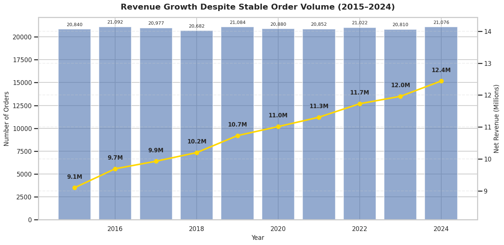
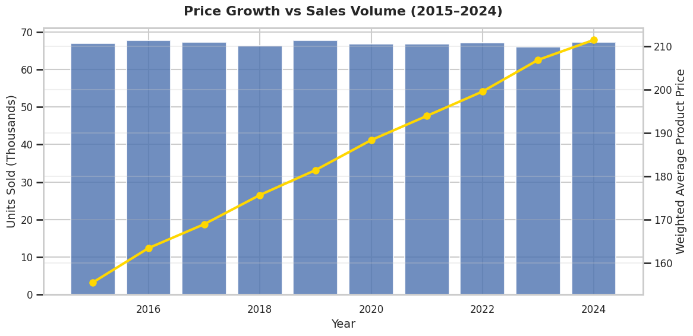
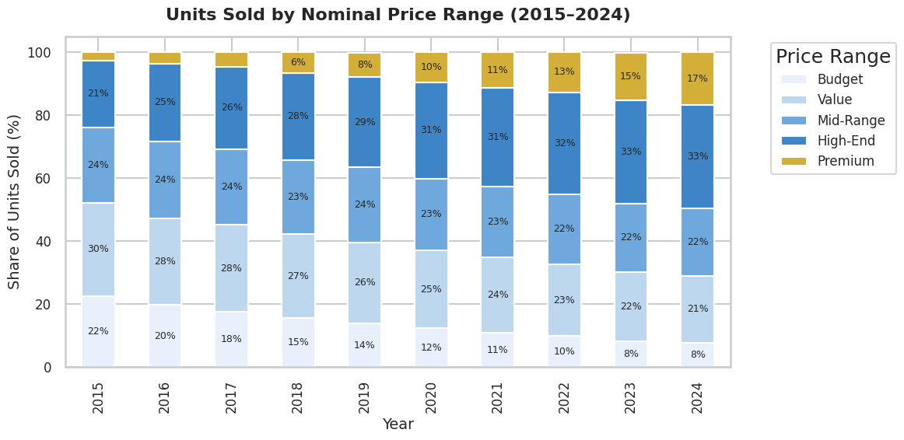
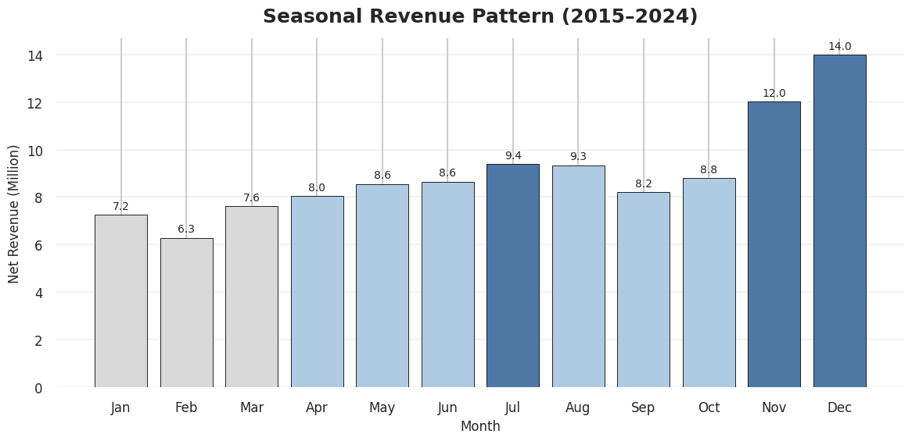
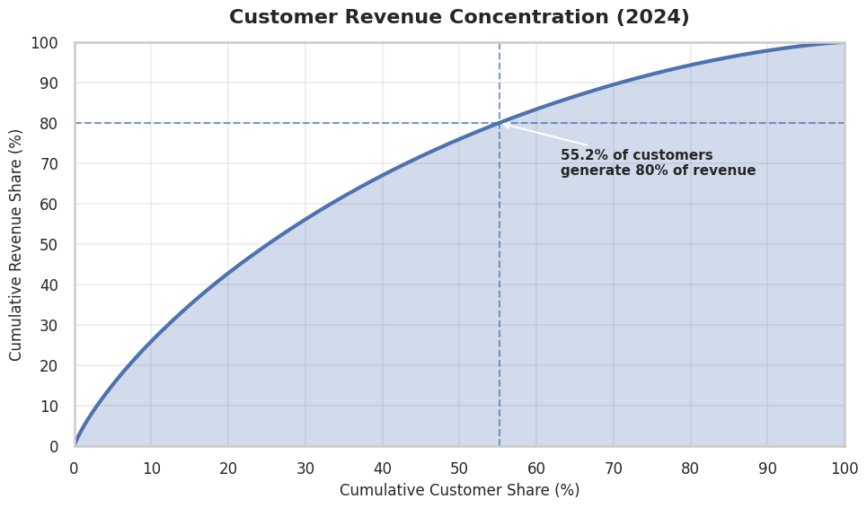

# Business analysis of sales, products and customer behaviour from 2015 to 2024.

## What Was Really Driving Revenue Growth in Fashion Retail?

Revenue growth is usually associated with selling more products. While exploring this dataset, I noticed that the company followed a different pattern. Revenue continued to rise, but the annual number of orders remained almost unchanged. This raised the question that shaped the entire project:

**If the business was not processing more transactions, where was the additional revenue coming from?**

To find the answer, I combined ten years of sales activity with product and recorded inventory data. Instead of treating pricing, discounts, markets, products and customers as separate topics, I followed one result into the next. Each stage of the analysis was used to test a possible explanation for the observed growth.

The project is based on **256,506 sales records**, **2,500 products** and **3,741 recorded inventory rows**. Before calculating the main metrics, I separated valid sales activity from orders for which net revenue could be assessed. Orders with a missing discount remained available when analysing customer and order activity, but they were excluded from calculations that required net revenue. Records containing the unresolved quantity = 608 value were also excluded from the main analytical population because their validity could not be confirmed.

## Revenue increased, but the business was not processing more orders

The first step was to compare annual net revenue with the number of analysed orders. If growth had been driven mainly by higher sales volume, both measures should have increased at a similar pace.

<p align="center">
  
</p>

<p align="center">
  <i><b>Figure 1.</b> Nominal net revenue increased despite a nearly unchanged number of annual orders.</i>
</p>

Between 2015 and 2024, nominal net revenue increased by **36.8%**, while the number of analysed orders increased by only **1.1%**. The company was therefore generating considerably more revenue without completing substantially more transactions.
Average Order Value provided the first important clue. It increased from **436 in 2015 to 590 in 2024**, representing growth of **35.3%**. This explained the mathematical difference between revenue and order volume, but it did not yet explain what was changing inside the orders. Customers could have been buying more products, choosing products with higher prices or receiving lower discounts. The next stage of the analysis separated these possibilities.

## Customers were not buying substantially more units

To determine whether larger baskets were responsible for the increase, I compared the number of units sold with the quantity-weighted gross unit price. A weighted measure was used because a simple average would give the same importance to a product sold once and a product sold thousands of times.

<p align="center">
  
</p>

<p align="center">
  <i><b>Figure 2.</b> Units sold remained stable while the quantity-weighted unit price increased.</i>
</p>

The number of sold units increased by only **0.5%** between 2015 and 2024, while the quantity-weighted gross unit price increased by approximately **36.0%**. Customers were therefore not creating higher order values by adding substantially more products to their baskets. The main numerical change was the recorded value of the products being purchased. A higher weighted price could still be created in two different ways. The company might have sold a larger share of its more expensive products, or the recorded prices of individual products might have increased. To separate these effects, I compared products that were sold in both 2015 and 2024.

Within this common-product population, product-level price changes explained **99.5%** of the increase in weighted unit price, while changes in product unit shares explained only **0.5%**. This narrowed the explanation considerably. The increase in revenue was connected mainly with higher recorded prices for individual products rather than a major change in the number of units sold or the combination of products selected by customers. This is a numerical decomposition, not proof that the pricing strategy caused the growth. Inflation, product costs, competitor prices and margins are not available, so the analysis cannot determine whether the higher nominal revenue also represented stronger real or profitable performance.

## Sales increasingly occurred in higher nominal price ranges

Although individual product prices explained most of the weighted-price increase, the structure of sales across price ranges was also changing. I divided products into nominal price segments and measured how much of the total unit volume each segment represented.

<p align="center">
  
</p>

<p align="center">
  <i><b>Figure 3.</b> Premium and High-End products accounted for a growing share of sold units.</i>
</p>

Between 2015 and 2024, the Premium share of sold units increased by **14.4 percentage points**, while the High-End share increased by **11.3 points**. Over the same period, the Budget share fell by **14.8 points**. On its own, this result could suggest that customers were deliberately switching towards more expensive products. The earlier product-level decomposition shows why that interpretation would be incomplete. The price ranges are nominal, which means that the same product can move into a higher segment when its recorded price changes.

The two results therefore need to be read together. Sales increasingly occurred in higher nominal price ranges, but the dominant explanation was the increase in individual product prices rather than a substantial change in the number or type of products purchased.

## Average Order Value still needed to be checked against the distribution

Average Order Value is useful, but it can be influenced by a relatively small number of very large transactions. Before treating the increase as representative of the wider order base, the updated analysis also compares the median and upper percentiles of order value.

<p align="center">
  
</p>

<p align="center">
  <i><b>Figure 4.</b> Changes in the median and upper percentiles of order value.</i>
</p>

Between 2015 and 2024, the median order value changed by **[MEDIAN_CHANGE]%**, while the 75th and 90th percentiles changed by **[P75_CHANGE]%** and **[P90_CHANGE]%**. The top 10% of analysed orders generated **[TOP_10_REVENUE_SHARE]%** of net revenue in 2024. These results will show whether the increase in transaction value was visible across a broad part of the order distribution or was concentrated mainly among the largest purchases. The final interpretation should be added only after the updated analysis has been run.

## Discounts supported sales, but they did not explain the long-term growth

Discounting was part of normal commercial activity throughout the analysed period. Orders with discounts of no more than 20% represented **78.9% of all analysed orders** and generated **82.0% of analysed net revenue**. Most revenue was therefore generated without very high discount levels. Discounts supported sales, but the available data does not indicate that increasingly aggressive promotions were responsible for the long-term increase in revenue.

A stronger conclusion would require campaign dates, offer types, customer exposure and product margins. Without these variables, it is possible to describe the discount structure, but not to determine whether a promotion created additional sales or merely reduced the value of transactions that would have happened anyway.

## The same seasonal pattern appeared in every analysed year

After identifying the main numerical driver of growth, I examined whether revenue was distributed evenly throughout the calendar. The monthly results revealed a remarkably consistent pattern.

<p align="center">
  
</p>

<p align="center">
  <i><b>Figure 5.</b> December generated the highest revenue and February the lowest in every analysed year.</i>
</p>

December was the strongest month and February the weakest in each year from 2015 to 2024. The difference remained substantial after accounting for the different number of days in each month. Average daily revenue in December was **2.03 times** the February level. The repeated year-end peak is strong enough to be included in commercial and fulfilment planning. It does not automatically mean that the company should increase promotional spending before Christmas. That decision would require information about campaign cost, contribution margin, available inventory, fulfilment capacity and the incremental sales created by additional marketing activity.

## Similar market totals concealed different growth paths

Total ten-year revenue was relatively evenly distributed across the analysed markets. Looking only at the final totals could therefore suggest that their performance was almost identical. The annual results showed a more complicated picture. 
France recorded the strongest increase between 2015 and 2024 at **40.4%**, while the Czech Republic recorded **32.8%**. Across the complete market-year series, I identified **13 year-over-year revenue declines**. The markets reached a similar overall scale, but they did not follow the same path and their growth was not uninterrupted.

The product structure was more consistent. Shoes remained the largest category in every market and generated approximately **28–29% of country revenue**, while the Women category contributed around **24%**. At subcategory level, Bags, Scarves and Jewelry recorded the strongest growth, while the weakest increases were concentrated in Men's Outerwear, Kids' Shoes and Men's Jeans.
These differences identify areas that deserve more detailed commercial review, but revenue alone is not enough to decide where the company should invest. A high-growth category may also have high product costs, return rates or fulfilment expenses. Without those measures, the analysis can identify differences in sales performance but cannot rank product areas by profitability.

## Revenue was distributed across a wider customer base than expected

The next question was whether the company depended heavily on a small number of high-value customers. To test this, I ranked active customers by their analysed 2024 revenue and measured how much of the customer base was required to generate the majority of sales.

<p align="center">
  
</p>

<p align="center">
  <i><b>Figure 6.</b> More than half of active customers were required to generate 80% of analysed revenue.</i>
</p>

In 2024, **55.2% of active customers** were required to generate 80% of analysed revenue. The highest-spending 10% generated **25.9%**, while the lower half of customers generated **24.0%**. The customer base therefore did not follow a classic 80/20 pattern. Revenue was distributed across a relatively broad group rather than being dominated by a small number of customers. This meant that identifying only the highest-spending segment would not provide enough information about the stability of the customer base. The next step was to examine whether customers remained active over time.

## One-third of customers had also purchased in the previous year

Among customers active in 2024, **32.5% had also made a purchase in 2023**. This group generated **33.2% of analysed 2024 revenue**, so its revenue contribution was close to its share of the active customer population. I describe this result as consecutive-year activity rather than formal retention. The dataset does not contain a confirmed customer acquisition date or a defined purchase cycle, and the absence of a transaction in one calendar year does not prove that the customer permanently left the company. The result still raised a useful forward-looking question:

**Could the behaviour observed in one year help identify customers who were most likely to purchase in the following year?**

## Turning historical customer behaviour into a predictive problem

Instead of ending the project with a historical repeat-purchase percentage, I transformed the transaction history into annual customer snapshots. Each row represents one customer in one feature year, while the target shows whether that customer made at least one valid observed purchase in the following calendar year.
The model uses only information that would have been available at the end of the feature year. The customer description includes how recently the last purchase occurred, how many orders were placed, how much assessable revenue was generated, how many months contained activity and how broad the customer's product and category selection was. It also includes average and median order value, activity during the final 90 and 180 days of the year, discount behaviour, previous-year activity and observed customer tenure. Raw customer and order identifiers are retained only as keys and are not used as predictors. The model should learn from customer behaviour, not from arbitrary identifier values. The evaluation is chronological because a random train-test split would mix earlier and later customer periods. Customer-years from 2016 to 2021 form the training population. Behaviour observed in 2022 is used to validate purchases in 2023, while behaviour from 2023 forms the untouched final test for purchases observed in 2024.

Regularised Logistic Regression and Random Forest are compared with a constant-probability baseline and a simple rule based on previous-year activity. The purpose is not to select the most complicated model, but to determine whether modelling provides a meaningful improvement over a decision that could be made from one historical variable.

<p align="center">
  
</p>

<p align="center">
  <i><b>Figure 7.</b> Actual next-year purchase activity across customer groups ranked by the model.</i>
</p>

On the final 2023-to-2024 test period, **[SELECTED_MODEL]** achieved a ROC-AUC of **[ROC_AUC]** and Average Precision of **[AVERAGE_PRECISION]**. The 20% of customers with the highest predicted scores contained **[CAPTURE_RATE]%** of all customers who actually purchased in the following year, producing a lift of **[LIFT]** compared with the average test-population purchase rate. The practical value of the model does not depend only on assigning every customer to a class using one probability threshold. A business is unlikely to contact the complete customer base. The more relevant question is whether customers who later purchased are concentrated near the top of the ranking, where a limited campaign or further review could be focused.

## Purchase probability and customer value answer different questions

A high probability of purchasing again does not automatically mean that a customer should receive the strongest promotional offer. Some customers may return without any additional contact, while a high-value customer with a lower natural purchase probability may represent a more important reactivation opportunity.

For that reason, the predicted probability is combined with assessable customer revenue. This separates high-value customers who are likely to remain active, high-value customers with a lower estimated probability of returning, lower-value customers with development potential and customers who currently represent a lower commercial priority.

The framework helps organise customer review, but it should not be used as an automatic contact or exclusion rule. It describes historical behaviour and expected natural activity. It does not show how an individual customer would react to a specific marketing action.

## What marketing data would add to the analysis

The current model answers **who is likely to purchase again**. It cannot determine **whose behaviour would change because of a campaign**. To answer the second question, the company would need campaign exposure, contact dates, communication channels, offer types and a reliable treatment and control indicator. These variables would make it possible to distinguish customers who were likely to purchase anyway from customers whose purchase probability increased because they received the campaign. Acquisition source and marketing spend would add the cost of creating the customer relationship. The company could then compare repeat-purchase behaviour, revenue and margin between customers acquired through different channels, while also calculating Customer Acquisition Cost and the time required to recover that cost. This would also prevent a potentially misleading conclusion. A channel with a lower acquisition cost is not automatically better if its customers purchase once and disappear, while a more expensive channel may attract customers who return more often and create more value over time. Campaign cost, discount cost, product margin, returns and fulfilment expenses would allow the company to move beyond purchase probability and assess expected incremental profit:

```text
expected incremental profit
= incremental response probability
× expected contribution margin
− contact and incentive cost
```

The strongest extension of the project would therefore be a randomised campaign with a control group. The existing data helps identify **who is likely to return**. Marketing-response data would help identify **who should be contacted**, while cost and experimental data would show **which action creates additional profit**.

## Why the inventory data was not used for optimisation

The inventory dataset initially appeared to offer an opportunity to compare product demand with stock allocation. Its update history changed the scope of the analysis. Approximately **85.0% of inventory rows were more than 90 days old**, while the median time since the recorded update was **303 days**. Data with this level of staleness cannot support reliable conclusions about current shortages, excess stock or replenishment requirements. The recorded inventory structure was relatively close to the category structure of 2024 unit sales, and the largest difference between the category shares was **1.3 percentage points**. This is a useful structural comparison, but it does not prove that stock was sufficient, located in the correct warehouse or recorded at the same time as the demand it is being compared with. Rather than force an operational recommendation from outdated records, I retained the inventory section as an example of how data quality determines which business questions can be answered responsibly. Reliable inventory optimisation would require current warehouse-level stock, historical inventory snapshots, product demand, stockouts, lead times and product cost.

## What the analysis revealed

The company generated substantially more nominal revenue without completing substantially more orders or selling substantially more units. Average Order Value increased by **35.3%**, while the weighted unit price increased by approximately **36.0%**. Within the common-product population, product-level price changes accounted for **99.5%** of the weighted-price increase.

Sales increasingly occurred in higher nominal price ranges, but the shift should not be interpreted as a major change in customer preference without considering the increase in individual product prices. Discounts remained concentrated at moderate levels, with **82.0% of analysed revenue** generated from orders discounted by no more than 20%.
The revenue pattern was not uniform across time, markets or products. December remained the strongest month in every analysed year, market performance included **13 annual declines**, and product growth varied considerably between categories and subcategories.

Revenue was also distributed across a wider customer base than an 80/20 assumption would suggest. This made next-year customer activity a more useful analytical problem than focusing exclusively on a narrow group of top spenders.
The predictive extension moves the project from historical explanation to customer prioritisation while preserving an important distinction: purchase propensity describes what customers are likely to do naturally, not how they will respond to a marketing intervention.

## Business implications

Future performance should be monitored using more than revenue and Average Order Value. Orders, units, the median and upper percentiles of order value, quantity-weighted prices, margins and returns should be analysed together so that a rise in nominal revenue is not automatically interpreted as stronger commercial performance.

Product-level price changes should be compared with unit response and profitability before further pricing decisions are made. The recurring November–December peak should be included in commercial and fulfilment planning, but additional promotional spending should be evaluated through controlled tests rather than inferred from seasonality alone.

Market and product differences should be investigated below the revenue level. Margin, returns and cost-to-serve are needed before the strongest-growing area can be treated as the best investment opportunity.

The customer model should be used to prioritise further review and experiments. It estimates observed next-year activity, but it does not predict customer profitability, campaign response or the causal effect of contacting an individual customer.

## Limitations

Revenue is analysed in nominal terms because inflation-adjusted values are unavailable. Orders with missing discounts remain available for activity analysis but do not contribute to net-revenue calculations, while records containing the unresolved quantity = 608 value are excluded from the main analytical population.

The dataset begins in 2015, so the first observed purchase may not represent the true start of a customer relationship. The predictive target uses a calendar-year horizon and should not be interpreted as permanent customer churn.

Product cost, margin, returns, acquisition source, campaign exposure and communication history are unavailable. The model therefore estimates natural next-year purchase activity rather than campaign response or incremental profit.

Predictions produced from 2024 customer behaviour for purchases in 2025 cannot be evaluated until later sales activity becomes available. The recorded inventory file is also too old to support current operational recommendations.

## Repository structure

```text
retail-revenue-repeat-purchase/
├── assets/
│   ├── 01_revenue_orders_aov.png
│   ├── 02_weighted_price_units.png
│   ├── 03_price_segment_mix.png
│   ├── 04_monthly_seasonality.png
│   ├── 05_order_value_distribution.png
│   ├── 06_customer_revenue_concentration.png
│   └── 07_model_lift.png
├── notebooks/
│   └── Retail_Sales_Business_Analysis.ipynb
├── README.md
├── requirements.txt
└── LICENSE
```

The analysis was created in Python using Pandas, NumPy, Matplotlib and Scikit-learn.
